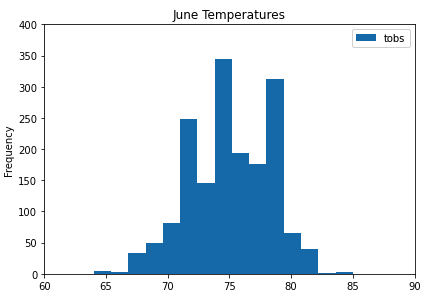
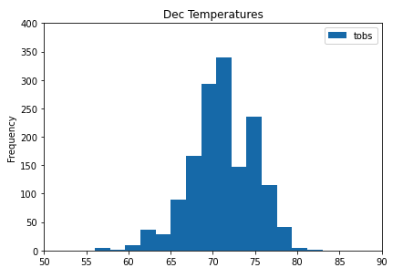
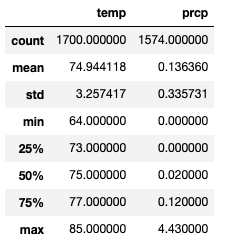
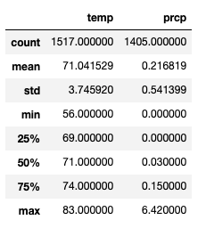
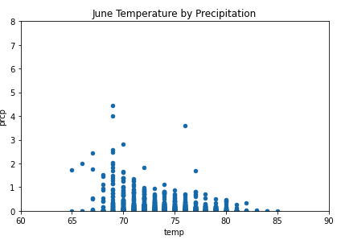
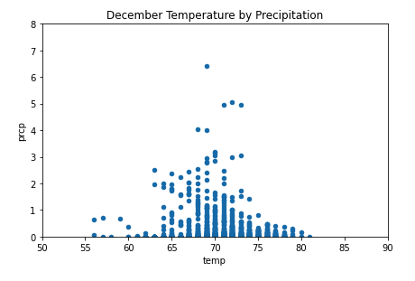

# Surfs Up 


---

## Overview

After my vacation to Hawaii, I decided my goal in life was to open a Surf n' Shake Shop on the island of Oahu.  I quickly wrote up a solid business plan and searched for an investor.  I chose W. Avy, who is famous for his love of surfing.  He is excited to invest in my Surf n' Shake Shop, as long I do due diligence on the weather and temperature on the island of Oahu, as he attempted this early in his career, and where he set his surf shop up at, it rained constantly and his shop failed. I set out to see if the island of Oahu would be a good choice for my Surf n' Shake Shop.

* Since I have been interested in Data Analytics I pressed forward in analyizing the Weather details of Oahu for the past year, specificially in the areas of temperature and rainfall.
* W. Avy provided me with data in the form of a sqlite database of hawaii weather data, and I will be using this to prepare the analysis.
* The tools I will be using will be Python, Pandas, sqlite, SQLAlchemy as well as Mathplotlib so I can display the statistics in a more user friendly manor.

## Resources
* Data Sources: hawaii.sqlite
* Software: Python 3.7.10, Jupyter Notebook 6.3.0, sqlAlchemy, sqlite 

## Results

1) The first thing I needed to do was read in the hawaii.sqlite database data and begin querying the temperatures.  I started with gathering the weather stations for Oahu, and determining which station was capturing the most data for the area.  As there were 9 stations, the one that captured the most readings, we felt would give us the most data.   To determine this, we ran this query against the hawaii.sqlite database:
```
session.query(Measurement.station, func.count(Measurement.station)).\
group_by(Measurement.station).order_by(func.count(Measurement.station).desc()).all()
```
The results showed the following:
```
[('USC00519281', 2772),
 ('USC00519397', 2724),
 ('USC00513117', 2709),
 ('USC00519523', 2669),
 ('USC00516128', 2612),
 ('USC00514830', 2202),
 ('USC00511918', 1979),
 ('USC00517948', 1372),
 ('USC00518838', 511)]
 ```
This set us in motion to use the station USC00519281 for our future queries.

2) The next step was to be able to show W. Avy how the temperatures would show for the 2 months based on a histogram.  I divided the temperatures into 15 bins to see the frequency of the temperatures during the month. The plotting of these used Matplotlib and setting the bins=15.
```
june_df.plot.hist(bins=15)
plt.tight_layout()
plt.title('June Temperatures')
plt.xlim([60,90])
plt.ylim([0,400])

dec_df.plot.hist(bins=15)
plt.tight_layout()
plt.title('Dec Temperatures')
plt.xlim([50,90])
plt.ylim([0,400])
```

       

3) The third step in our process was to determine the statistics for the temperature and precipitation.  In these queries I created the dataframes for each month to have both the temperature and the precipitation in the dataframe.  What we are looking for are the:
  * count - _total number of items in the dataset_
  * mean - _the average number of items in the dataset_
  * standard deviation - _a measure of how spread out numbers in a dataset are_
  * mininum value - _the smallest number in the dataset_
  * max value - _the largest number in a dataset_
  * 25% quartile - _in the bottom 25% of the dataset_
  * 50% quartile - _in the bottom 50% of the dataset_
  * 75% quartile - _in the bottom 75% of the dataset_
  
We chose to look at June and December, as those months are 6 months apart, and are some of the hottest as well as coldest times of the year.  Our queries against the hawaii.sqlite database were:
```
june_temp_prcp = []
june_temp_prcp = session.query(Measurement.tobs, Measurement.prcp).filter(extract('month', Measurement.date) == 6).all()
june_temp_prcp_df = pd.DataFrame(june_temp_prcp, columns = ['temp','prcp'])
june_temp_prcp_df.describe()

dec_temp_prcp = []
dec_temp_prcp = session.query(Measurement.tobs, Measurement.prcp).filter(extract('month', Measurement.date) == 12).all()
dec_temp_prcp_df = pd.DataFrame(dec_temp_prcp, columns = ['temp','prcp'])
dec_temp_prcp_df.describe()
```
        

---

4) My final step in showing W. Avy if Oahu was a good location to open the Surf n' Shake shop was to plot both the temperature and the precipitation together on the same chart.  To do this I went with a different chart, and chose a scatter plot to see how these 2 different sets of data would present.  I used the same dataframes from step 3 that held both the temperature and precipitation values and set up the plot as a scatter plot.
```
june_temp_prcp_df.plot.scatter('temp','prcp')
plt.tight_layout()
plt.title('June Temperature by Precipitation')
plt.xlim([60,90])
plt.ylim([0,8])

dec_temp_prcp_df.plot.scatter('temp','prcp')
plt.tight_layout()
plt.title('December Temperature by Precipitation')
plt.xlim([50,90])
plt.ylim([0,8])
```
       

## Summary

Review of the Statitical Data
**June**                                        **December**
_Avg Temperature_: 74.9F                        _Avg Temperature_: 71.0F
_Max Temperature_: 85.0F                        _Max Temperature_: 83.0F
_Min Temperature_: 65.0F                        _Min Temperature_: 56.0F
_Avg Rainfall_:      .3in                       _Avg Rainfall_:      .2in
_Max Rainfall_:     4.4in                       _Max Rainfall_:     6.4in
_Min Rainfall_:      .0in                       _Min Rainfall_:      .0in
